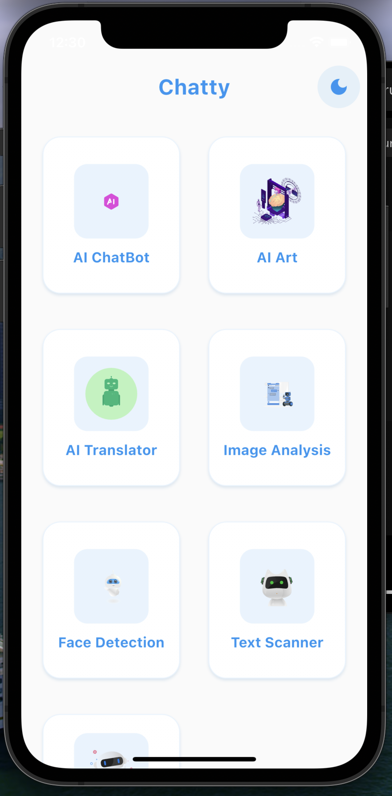
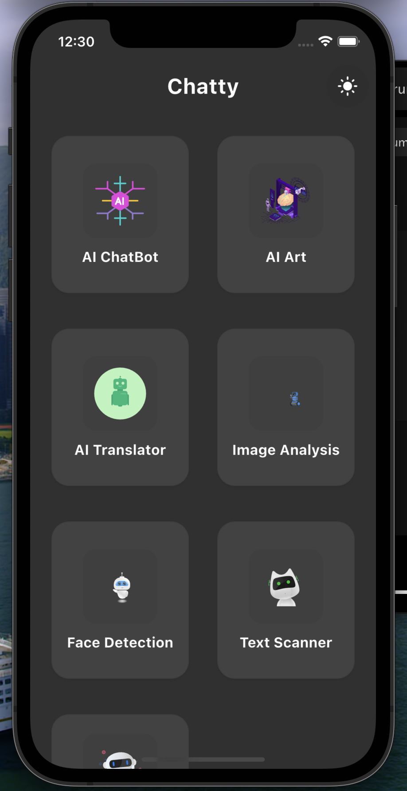
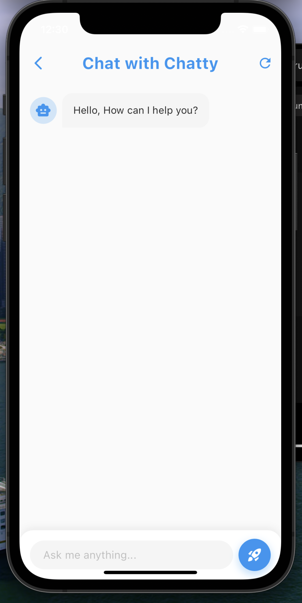
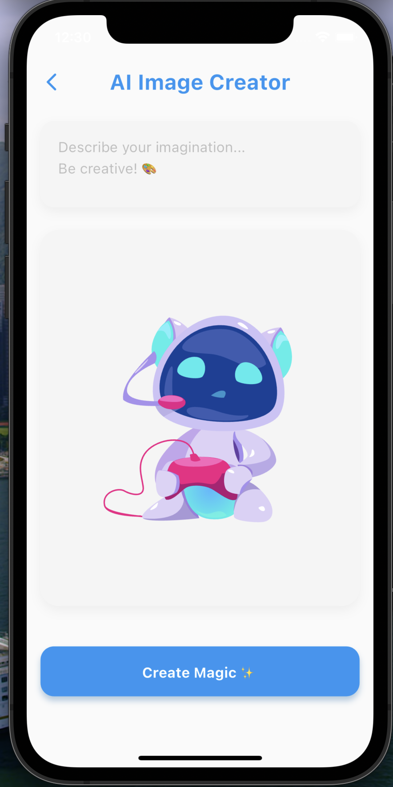
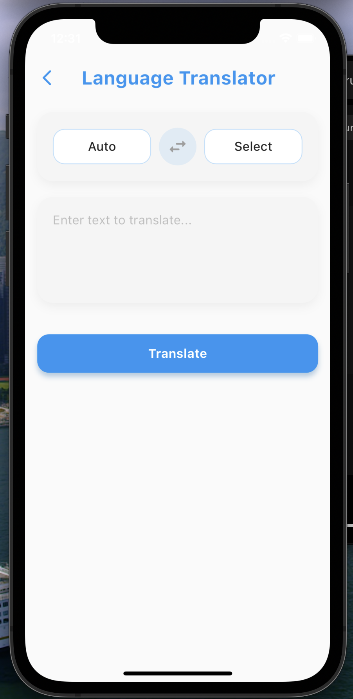
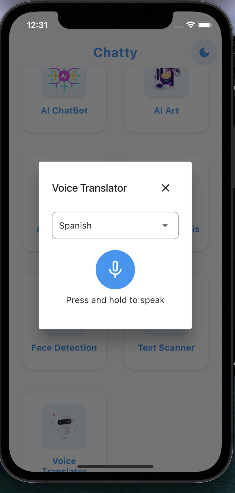
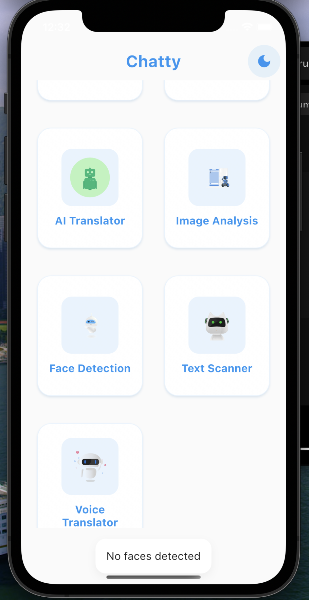
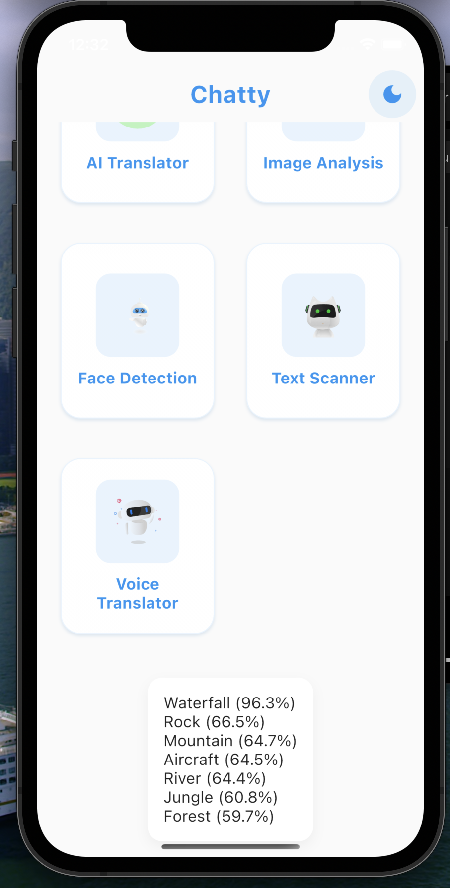

# Chatty App 🤖

A powerful Flutter application that integrates various AI capabilities including speech recognition, image processing, text translation, and more.

## 📱 Screenshots

  
   
  
  

  
  
  
  

## ✨ Features

### 🤖 AI Chat
- Smart conversational AI powered by Google Gemini
- Context-aware responses
- Code explanation and generation
- Natural language processing

### 🎨 AI Image Generation
- Create custom images from text descriptions
- Multiple style options
- High-resolution output
- Image history and gallery

### 🗣️ Voice Interaction
- Speech-to-Text conversion
- Text-to-Speech output
- Voice command processing
- Multi-language voice support

### 📸 Image Processing
- Image Analysis with ML Kit
- Face Detection with expression analysis
- OCR (Optical Character Recognition)
- Object labeling and detection

### 🌍 Language Features
- Multi-language translation
- Real-time language detection
- Support for 10+ languages
- Voice output in different languages

### 🎯 UI/UX Features
- Material 3 Design
- Dark/Light theme support
- Smooth animations
- Responsive layout
- Intuitive navigation
- Pull-to-refresh functionality

## 🚀 Getting Started

### Prerequisites
- Flutter SDK (>=3.2.0)
- Dart SDK (>=3.0.0)
- iOS 12.0 or higher
- Android 5.0 (API 21) or higher

## Usage

### AI Chat
- Open the ChatBot feature
- Type or speak your question
- Get instant AI-powered responses
- Copy or share responses

### Image Generation
- Select "AI Art" from home
- Describe your desired image
- Click "Create Magic"
- Save or share generated images

### Translation
- Choose source and target languages
- Enter or speak text
- Get instant translations
- Listen to translated audio

### Voice Commands
- Tap microphone button
- Speak naturally
- View real-time transcription
- Get AI-powered responses

## 🛠️ Technical Details

### Architecture
- GetX for state management
- Clean architecture principles
- Modular design
- Reactive programming

### APIs & SDKs
- Google ML Kit
- Google Gemini AI
- Flutter TTS
- Speech Recognition
- Image Processing

## 📄 License

This project is licensed under the MIT License - see the [LICENSE](LICENSE) file for details

## 🙏 Acknowledgments

- Google ML Kit for AI capabilities
- Flutter team for the framework
- LottieFiles for animations
- All contributors and supporters

